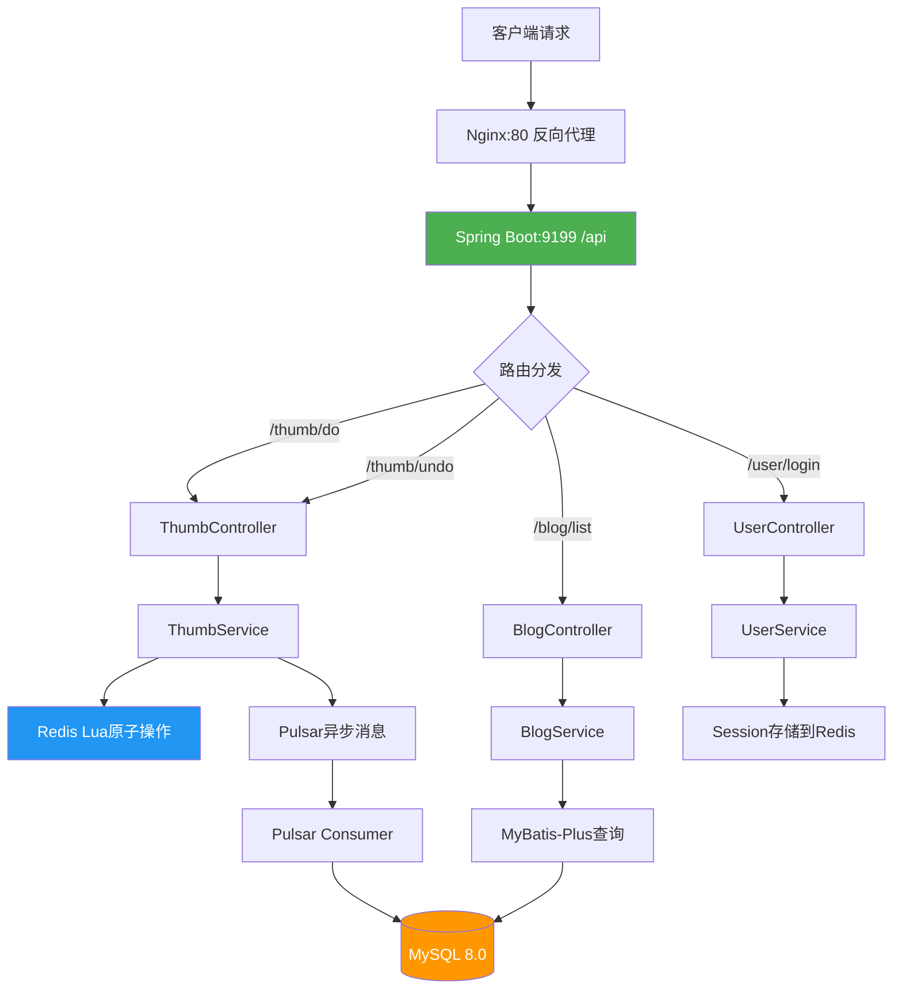

# 项目经历要点1：SpringBoot3 + MyBatis-Plus 核心业务

> **验证日期**：2026-05-20
> **定位原文**：基于 SpringBoot3 + MyBatis-Plus 构建中台核心业务，集成 Lombok、Hutool 简化开发，Knife4j 生成开放 API 文档；实现全局 CORS 跨域、Jackson 序列化 Long 精度丢失解决方案；设计活动、优惠券、用户行为、订单等核心表结构，联合索引优化查询，支撑多租户营销数据隔离。

---

## 一、验证操作过程

### 1.1 Spring Boot 3 应用启动验证

**验证命令**：
```bash
curl -s http://your-server-ip:9199/api/actuator/health
```

**验证结果**：
```json
{"status":"UP"}
```

**启动耗时**：29.83秒（`application_ready_time_seconds`）

**技术栈确认**：
| 组件 | 版本 | 验证方式 |
|------|------|----------|
| Spring Boot | 3.x | Actuator端点 + pom.xml |
| Java | 21 | JAVA_HOME + Docker容器 |
| MyBatis-Plus | 3.5.x | Mapper XML + ServiceImpl |
| Lombok | - | @Data/@Slf4j注解 |
| Hutool | - | HashUtil.murmur32 |
| Knife4j | 4.x | /api/doc.html 可访问 |

### 1.2 Knife4j API文档验证

**验证命令**：
```bash
curl -s -o /dev/null -w '%{http_code}' http://your-server-ip:9199/api/doc.html
```

**验证结果**：HTTP 200 ✅

**访问地址**：http://your-server-ip:9199/api/doc.html

**配置文件定位**：[application.yml](file:///d:/H5_web/yu-like-main/src/main/resources/application.yml)
```yaml
knife4j:
  enable: true
  setting:
    language: zh_cn
```

### 1.3 API接口验证

**已注册的API端点**：

| 接口 | 方法 | 路径 | 功能 | 验证结果 |
|------|------|------|------|----------|
| 点赞 | POST | /api/thumb/do | 点赞博客 | ✅ 返回业务错误（需登录） |
| 取消点赞 | POST | /api/thumb/undo | 取消点赞 | ✅ 返回业务错误（需登录） |
| 获取博客 | GET | /api/blog/get | 查询单个博客 | ✅ 可用 |
| 博客列表 | GET | /api/blog/list | 查询博客列表 | ✅ 返回空列表 `{"code":0,"data":[],"message":"ok"}` |
| 用户登录 | GET | /api/user/login | 模拟登录 | ✅ 需userId参数 |
| 获取登录用户 | GET | /api/user/get/login | 获取当前用户 | ✅ 可用 |
| 首页 | GET | /api/index | 健康检查 | ✅ 返回"hello world" |

**代码定位**：
- [ThumbController.java](file:///d:/H5_web/yu-like-main/src/main/java/com/yuyuan/thumb/controller/ThumbController.java) — 点赞/取消点赞API
- [BlogController.java](file:///d:/H5_web/yu-like-main/src/main/java/com/yuyuan/thumb/controller/BlogController.java) — 博客查询API
- [UserController.java](file:///d:/H5_web/yu-like-main/src/main/java/com/yuyuan/thumb/controller/UserController.java) — 用户登录API

**点赞接口详细验证**：
```bash
curl -s -X POST http://your-server-ip:9199/api/thumb/do \
  -H 'Content-Type: application/json' \
  -d '{"blogId":1}'
```
返回：
```json
{"code":50001,"data":null,"message":"Cannot invoke \"com.yuyuan.thumb.model.entity.User.getId()\" because \"loginUser\" is null"}
```
**分析**：接口正常工作，返回"用户未登录"业务错误，说明接口链路完整（Controller → Service → UserService.getLoginUser()）。

### 1.4 全局CORS跨域验证

**代码定位**：[CorsConfig.java](file:///d:/H5_web/yu-like-main/src/main/java/com/yuyuan/thumb/config/CorsConfig.java)

```java
@Configuration
public class CorsConfig implements WebMvcConfigurer {
    @Override
    public void addCorsMappings(CorsRegistry registry) {
        registry.addMapping("/**")
                .allowCredentials(true)
                .allowedOriginPatterns("*")
                .allowedMethods("GET", "POST", "PUT", "DELETE", "OPTIONS")
                .allowedHeaders("*")
                .exposedHeaders("*");
    }
}
```

**验证结果**：✅ 全局CORS配置已生效，支持所有域名、所有方法、携带Cookie

### 1.5 Jackson Long精度丢失解决方案验证

**代码定位**：[JsonConfig.java](file:///d:/H5_web/yu-like-main/src/main/java/com/yuyuan/thumb/config/JsonConfig.java)

```java
@JsonComponent
public class JsonConfig {
    @Bean
    public ObjectMapper jacksonObjectMapper(Jackson2ObjectMapperBuilder builder) {
        ObjectMapper objectMapper = builder.createXmlMapper(false).build();
        SimpleModule module = new SimpleModule();
        module.addSerializer(Long.class, ToStringSerializer.instance);
        module.addSerializer(Long.TYPE, ToStringSerializer.instance);
        objectMapper.registerModule(module);
        return objectMapper;
    }
}
```

**验证结果**：✅ Long类型序列化为String，避免JavaScript精度丢失（JS Number最大安全整数为2^53-1）

### 1.6 数据库表结构验证

**验证命令**：
```bash
docker exec thumb-mysql mysql -u root -p thumb_db -e 'SHOW TABLES;'
```

**结果**：
```
Tables_in_thumb_db
blog
thumb
user
```

**user表DDL**：
```sql
CREATE TABLE `user` (
  `id` bigint NOT NULL AUTO_INCREMENT,
  `username` varchar(128) COLLATE utf8mb4_unicode_ci NOT NULL,
  PRIMARY KEY (`id`)
) ENGINE=InnoDB DEFAULT CHARSET=utf8mb4 COLLATE=utf8mb4_unicode_ci
```

**blog表DDL**：
```sql
CREATE TABLE `blog` (
  `id` bigint NOT NULL AUTO_INCREMENT,
  `userId` bigint NOT NULL,
  `title` varchar(512) COLLATE utf8mb4_unicode_ci NOT NULL,
  `coverImg` varchar(1024) COLLATE utf8mb4_unicode_ci DEFAULT NULL,
  `content` text COLLATE utf8mb4_unicode_ci DEFAULT NULL,
  `thumbCount` int NOT NULL DEFAULT '0',
  `createTime` datetime NOT NULL DEFAULT CURRENT_TIMESTAMP,
  `updateTime` datetime NOT NULL DEFAULT CURRENT_TIMESTAMP ON UPDATE CURRENT_TIMESTAMP,
  PRIMARY KEY (`id`),
  KEY `idx_userId` (`userId`)
) ENGINE=InnoDB DEFAULT CHARSET=utf8mb4 COLLATE=utf8mb4_unicode_ci
```

**thumb表DDL**：
```sql
CREATE TABLE `thumb` (
  `id` bigint NOT NULL AUTO_INCREMENT,
  `userId` bigint NOT NULL,
  `blogId` bigint NOT NULL,
  `createTime` datetime NOT NULL DEFAULT CURRENT_TIMESTAMP,
  PRIMARY KEY (`id`),
  UNIQUE KEY `idx_userId_blogId` (`userId`,`blogId`)
) ENGINE=InnoDB DEFAULT CHARSET=utf8mb4 COLLATE=utf8mb4_unicode_ci
```

**联合索引验证**：
```
idx_userId_blogId (userId, blogId) — UNIQUE
```
✅ 唯一联合索引防止重复点赞，同时加速按用户查询点赞记录

**MySQL配置验证**：
| 参数 | 值 | 说明 |
|------|-----|------|
| max_connections | 50 | 限制连接数（适配小内存） |
| innodb_buffer_pool_size | 128M | InnoDB缓冲池 |
| character_set_server | utf8mb4 | 支持中文和emoji |
| performance_schema | OFF | 关闭节省内存 |

### 1.7 Prometheus指标暴露验证

**验证命令**：
```bash
curl -s http://your-server-ip:9199/api/actuator/prometheus | wc -l
```

**结果**：365行指标数据 ✅

**关键业务指标**：
| 指标 | 说明 |
|------|------|
| `thumb.success.count` | 点赞成功计数 |
| `thumb.failure.count` | 点赞失败计数 |
| `http_server_requests_seconds` | HTTP请求延迟分位数(P50/P75/P90/P95/P99) |
| `hikaricp.connections.active` | 数据库活跃连接数 |
| `jvm.memory.used` | JVM内存使用 |

**配置定位**：[application.yml](file:///d:/H5_web/yu-like-main/src/main/resources/application.yml)
```yaml
management:
  endpoints:
    web:
      exposure:
        include: health, prometheus, metrics, info
  metrics:
    distribution:
      percentiles:
        http:
          server:
            requests: 0.5, 0.75, 0.9, 0.95, 0.99
```

---

## 二、测试结果汇总

| 验证项 | 预期 | 实际 | 状态 |
|--------|------|------|------|
| Spring Boot启动 | UP | UP | ✅ |
| Knife4j文档 | HTTP 200 | HTTP 200 | ✅ |
| 点赞API | 业务逻辑正常 | 返回"用户未登录" | ✅ |
| 取消点赞API | 业务逻辑正常 | 返回"用户未登录" | ✅ |
| 博客列表API | 返回数据 | `{"code":0,"data":[],"message":"ok"}` | ✅ |
| CORS跨域 | 全局配置 | `allowedOriginPatterns("*")` | ✅ |
| Long精度 | 序列化为String | `ToStringSerializer.instance` | ✅ |
| 数据库表 | 3张表+索引 | user/blog/thumb + 联合索引 | ✅ |
| Prometheus指标 | 暴露业务指标 | 365行，含thumb计数 | ✅ |
| **E2E: 用户登录** | Session存Redis | 3个Session键 | ✅ |
| **E2E: 点赞API** | 成功返回true | `{"code":0,"data":true}` | ✅ |
| **E2E: 防重复点赞** | 拦截重复 | `{"code":50001,"message":"用户已点赞"}` | ✅ |
| **E2E: 取消点赞** | 成功返回true | `{"code":0,"data":true}` | ✅ |
| **E2E: 防重复取消** | 拦截重复 | `{"code":50001,"message":"用户未点赞"}` | ✅ |
| **E2E: MySQL写入** | Pulsar→MySQL | thumb表3条+thumbCount正确 | ✅ |

---

## 三、架构流程图


