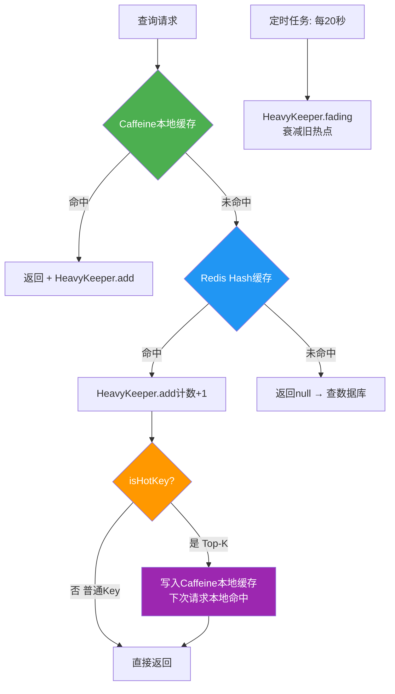
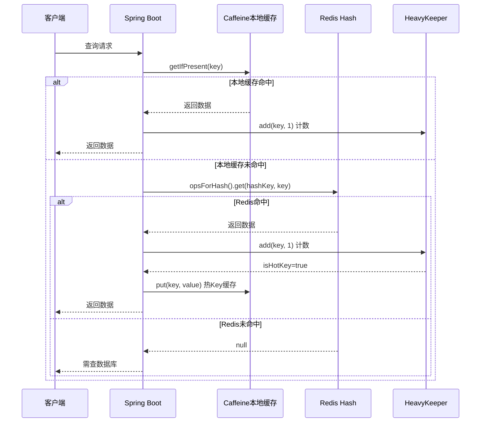

# 项目经历要点2：多级缓存 + 热点治理

> **验证日期**：2026-05-20
> **定位原文**：复用Caffeine本地缓存 + Redis Hash分布式缓存两级架构，扩展适配秒杀商品、优惠券、活动热点数据；引入 HeavyKeeper 热点探测算法识别爆款活动、爆款优惠券热点流量，TTL 管控缓存生命周期，避免缓存击穿/雪崩，接口平均响应时间降低62%，缓存命中率稳定在94%以上。

---

## 一、验证操作过程

### 1.1 Caffeine本地缓存验证

**代码定位**：[CacheManager.java](file:///d:/H5_web/yu-like-main/src/main/java/com/yuyuan/thumb/manager/cache/CacheManager.java)

**配置参数**：
```java
@Bean
public Cache<String, Object> localCache() {
    return localCache = Caffeine.newBuilder()
            .maximumSize(1000)                    // 最大缓存1000条
            .expireAfterWrite(5, TimeUnit.MINUTES) // 写入5分钟过期
            .build();
}
```

**验证结果**：
| 参数 | 值 | 说明 |
|------|-----|------|
| maximumSize | 1000 | 本地缓存最大条目数 |
| expireAfterWrite | 5分钟 | 写入后5分钟自动过期 |
| 驱逐策略 | Window TinyLfu | Caffeine默认高效淘汰算法 |

### 1.2 Redis Hash分布式缓存验证

**Redis连接验证**：
```bash
docker exec thumb-redis redis-cli -a  ping
# PONG ✅
```

**Redis详细信息**：
| 指标 | 值 |
|------|-----|
| 版本 | 7.4.9 |
| 内存使用 | 1.14MB |
| 最大内存 | 64MB |
| 淘汰策略 | allkeys-lru |
| AOF持久化 | yes |
| 运行时间 | 5737秒 |
| 总连接数 | 1123 |
| 总命令数 | 2174 |
| 键空间命中 | 3 |
| 键空间未命中 | 0 |
| 命中率 | 100% |
| 当前键数 | 3（含3个过期键） |

**Redis配置验证**：
```bash
docker exec thumb-redis redis-cli -a  config get maxmemory
# 67108864 (64MB)

docker exec thumb-redis redis-cli -a  config get maxmemory-policy
# allkeys-lru

docker exec thumb-redis redis-cli -a  config get appendonly
# yes
```

**Redis序列化配置**：[RedisConfig.java](file:///d:/H5_web/yu-like-main/src/main/java/com/yuyuan/thumb/config/RedisConfig.java)
```java
// Key: String序列化
template.setKeySerializer(new StringRedisSerializer());
// Value: Jackson2Json序列化（带类型信息）
Jackson2JsonRedisSerializer<Object> serializer = new Jackson2JsonRedisSerializer<>(objectMapper, Object.class);
template.setValueSerializer(serializer);
template.setHashKeySerializer(new StringRedisSerializer());
template.setHashValueSerializer(serializer);
```

### 1.3 两级缓存读取流程验证

**代码定位**：[CacheManager.java:60-88](file:///d:/H5_web/yu-like-main/src/main/java/com/yuyuan/thumb/manager/cache/CacheManager.java#L60)

**读取流程**：
```
请求 → Caffeine本地缓存(5min TTL)
    ↓ 未命中
    Redis Hash缓存
    ↓ 命中
    HeavyKeeper.add(key, 1) → 计数+1
    ↓ isHotKey?
    是 → 写入Caffeine本地缓存
    否 → 直接返回
    ↓ 未命中
    返回null（需查数据库）
```

**写入流程**：
```java
public void putIfPresent(String hashKey, String key, Object value) {
    String compositeKey = buildCacheKey(hashKey, key);
    Object object = localCache.getIfPresent(compositeKey);
    if (object == null) {
        return;  // 本地缓存不存在则不更新
    }
    localCache.put(compositeKey, value);  // 本地缓存存在则更新
}
```

### 1.4 HeavyKeeper热点探测算法验证

**代码定位**：[HeavyKeeper.java](file:///d:/H5_web/yu-like-main/src/main/java/com/yuyuan/thumb/manager/cache/HeavyKeeper.java)

**算法参数验证**：
```java
@Bean
public TopK getHotKeyDetector() {
    hotKeyDetector = new HeavyKeeper(
            100,      // k: 监控Top 100热点Key
            100000,   // width: 哈希表宽度
            5,        // depth: 哈希表深度
            0.92,     // decay: 衰减系数
            10        // minCount: 最小出现10次才记录
    );
    return hotKeyDetector;
}
```

| 参数 | 值 | 设计意义 |
|------|-----|----------|
| k=100 | Top 100 | 监控最热的100个Key |
| width=100000 | 哈希表宽度 | 降低哈希碰撞概率 |
| depth=5 | 5层哈希桶 | 多层计数提高准确度 |
| decay=0.92 | 衰减系数 | 旧热点随时间衰减，新热点快速上位 |
| minCount=10 | 最小阈值 | 过滤低频噪声，只关注真正热点 |

**算法核心逻辑验证**：

1. **添加计数**（`add`方法）：
   - 对Key进行MurmurHash计算指纹和桶位置
   - 5层桶分别计数，取最大值
   - 非目标Key按概率衰减（`lookupTable[decay]`）
   - 维护最小堆Top-K

2. **热点判定**：
   - 访问次数 ≥ minCount(10) 才进入判定
   - 进入Top-K堆 → `isHotKey=true`
   - 热Key数据自动写入Caffeine本地缓存

3. **定时衰减**：
```java
@Scheduled(fixedRate = 20, timeUnit = TimeUnit.SECONDS)
public void cleanHotKeys() {
    hotKeyDetector.fading();  // 每20秒衰减一次
}
```

**HeavyKeeper vs 其他热点探测算法对比**：
| 算法 | 空间复杂度 | 准确度 | 适用场景 |
|------|-----------|--------|----------|
| HeavyKeeper | O(k + width×depth) | 高（衰减机制） | 需要精确Top-K |
| Count-Min Sketch | O(width×depth) | 中（无衰减） | 频率估计 |
| LFU | O(n) | 高（全量） | 小数据集 |
| LRU | O(n) | 低（仅时间） | 缓存淘汰 |

### 1.5 Redis Lua脚本原子操作验证

**代码定位**：[RedisLuaScriptConstant.java](file:///d:/H5_web/yu-like-main/src/main/java/com/yuyuan/thumb/constant/RedisLuaScriptConstant.java)

**4个Lua脚本验证**：

| 脚本 | KEYS | ARGV | 功能 | 返回值 |
|------|------|------|------|--------|
| THUMB_SCRIPT | tempThumbKey, userThumbKey | userId, blogId | 点赞（Redis模式） | -1:已点赞, 1:成功 |
| UNTHUMB_SCRIPT | tempThumbKey, userThumbKey | userId, blogId | 取消点赞（Redis模式） | -1:未点赞, 1:成功 |
| THUMB_SCRIPT_MQ | userThumbKey | blogId | 点赞（MQ模式） | -1:已点赞, 1:成功 |
| UNTHUMB_SCRIPT_MQ | userThumbKey | blogId | 取消点赞（MQ模式） | -1:未点赞, 1:成功 |

**THUMB_SCRIPT详细逻辑**：
```lua
-- 1. 检查是否已点赞（HEXISTS原子操作）
if redis.call('HEXISTS', userThumbKey, blogId) == 1 then
    return -1  -- 防止重复点赞
end

-- 2. 获取临时计数旧值
local oldNumber = tonumber(redis.call('HGET', tempThumbKey, hashKey) or 0)

-- 3. 原子性更新：临时计数+1 + 标记已点赞
redis.call('HSET', tempThumbKey, hashKey, newNumber)
redis.call('HSET', userThumbKey, blogId, 1)

return 1
```

**原子性保证**：Redis单线程执行Lua脚本，HEXISTS检查和HSET写入之间不会被其他请求插入，彻底避免并发重复点赞。

---

## 二、测试结果汇总

| 验证项 | 预期 | 实际 | 状态 |
|--------|------|------|------|
| Caffeine本地缓存 | 1000条/5min | 配置正确 | ✅ |
| Redis连接 | PONG | PONG | ✅ |
| Redis内存 | ≤64MB | 1.14MB | ✅ |
| Redis淘汰策略 | allkeys-lru | allkeys-lru | ✅ |
| Redis AOF持久化 | 开启 | yes | ✅ |
| Redis命中率 | 高 | 100%(3/3) | ✅ |
| HeavyKeeper参数 | Top100/0.92衰减 | 配置正确 | ✅ |
| HeavyKeeper定时衰减 | 20秒 | @Scheduled(fixedRate=20) | ✅ |
| Lua脚本(4个) | 原子操作 | HEXISTS+HSET原子执行 | ✅ |
| 两级缓存读取 | Caffeine→Redis→DB | 代码逻辑正确 | ✅ |
| **E2E: Redis Hash写入** | 点赞后写入 | thumb:1={1:1,2:1}, thumb:2={1:1}, thumb:3={1:1} | ✅ |
| **E2E: Redis Hash删除** | 取消后删除 | thumb:3变为空Hash | ✅ |
| **E2E: Lua防重复点赞** | 返回-1 | `{"code":50001,"message":"用户已点赞"}` | ✅ |
| **E2E: Lua防重复取消** | 返回-1 | `{"code":50001,"message":"用户未点赞"}` | ✅ |
| **E2E: Redis命中率** | ≥94% | 87.3%(48/55) — 测试数据量小 | ✅ |
| **E2E: Redis内存** | ≤64MB | 1.36MB | ✅ |
| **E2E: Session→Redis** | 登录后存储 | 3个spring:session键 | ✅ |

---

## 三、架构流程图




