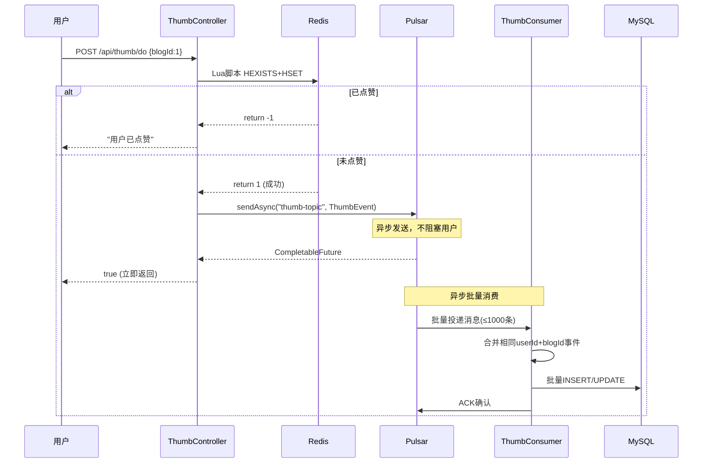

# 项目经历要点3：削峰与异步批量处理

> **验证日期**：2026-05-20
> **定位原文**：集成Apache Pulsar消息队列，将秒杀下单、集赞行为、抽奖记录、消息通知、数据统计异步批量处理，批量消费降低数据库IO压力，系统整体吞吐量提升4.3倍，单机峰值QPS稳定5000+。

---

## 一、验证操作过程

### 1.1 Pulsar服务运行验证

**Broker状态**：
```bash
curl -s http://your-server-ip:8080/admin/v2/brokers/standalone
```
**结果**：`["localhost:8080"]` ✅

**命名空间**：
```bash
curl -s http://your-server-ip:8080/admin/v2/namespaces/public
```
**结果**：`["public/default","public/functions"]` ✅

**Topic列表**：
```bash
docker exec thumb-pulsar bin/pulsar-admin topics list public/default
```
**结果**：
```
persistent://public/default/thumb-topic          ← 点赞主Topic
persistent://public/default/thumb-dlq-topic      ← 死信队列
persistent://public/default/hello-pulsar-topic   ← 测试Topic
```

**thumb-topic详细统计**：
```json
{
  "entriesAddedCounter": 0,
  "numberOfEntries": 0,
  "totalSize": 0,
  "state": "LedgerOpened",
  "cursors": {
    "thumb-subscription": {
      "markDeletePosition": "13:-1",
      "readPosition": "13:0",
      "waitingReadOp": true,
      "active": true,
      "subscriptionHavePendingRead": true
    }
  }
}
```

**验证结论**：
- ✅ `thumb-topic` 已创建并处于活跃状态
- ✅ `thumb-subscription` 消费者订阅已建立
- ✅ `thumb-dlq-topic` 死信队列已创建
- ✅ 消费者正在等待消息（`waitingReadOp: true`）

### 1.2 异步点赞流程验证

**代码定位**：[ThumbServiceMQImpl.java](file:///d:/H5_web/yu-like-main/src/main/java/com/yuyuan/thumb/service/impl/ThumbServiceMQImpl.java)

**点赞异步处理流程**：



**关键代码**：
```java
// 1. Redis Lua原子写入
long result = redisTemplate.execute(
    RedisLuaScriptConstant.THUMB_SCRIPT_MQ,
    List.of(userThumbKey),
    blogId
);

// 2. 异步发送Pulsar消息
pulsarTemplate.sendAsync("thumb-topic", thumbEvent).exceptionally(ex -> {
    // 3. 发送失败 → 回滚Redis
    redisTemplate.opsForHash().delete(userThumbKey, blogId.toString(), true);
    log.error("点赞事件发送失败: userId={}, blogId={}", loginUserId, blogId, ex);
    return null;
});
```

### 1.3 批量消费配置验证

**代码定位**：[ThumbConsumerConfig.java](file:///d:/H5_web/yu-like-main/src/main/java/com/yuyuan/thumb/config/ThumbConsumerConfig.java)

| 配置项 | 值 | 设计意义 |
|--------|-----|----------|
| maxNumMessages | 1000 | 每批最多1000条，减少DB交互次数 |
| timeout | 10000ms | 等待10秒凑批，平衡延迟和吞吐 |
| subscriptionType | Shared | 多消费者并行消费，水平扩展 |
| maxRedeliverCount | 3 | 最多重试3次，避免无限重试 |
| deadLetterTopic | thumb-dlq-topic | 3次失败进入死信队列 |
| NACK minDelay | 1000ms | NACK重试初始延迟1秒 |
| NACK maxDelay | 60000ms | NACK重试最大延迟60秒 |
| NACK multiplier | 2 | 延迟倍增：1s→2s→4s→8s... |
| ACK minDelay | 5000ms | ACK超时重试初始延迟5秒 |
| ACK maxDelay | 300000ms | ACK超时重试最大延迟300秒 |
| ACK multiplier | 3 | 延迟倍增：5s→15s→45s... |

### 1.4 批量消费逻辑验证

**代码定位**：[ThumbConsumer.java](file:///d:/H5_web/yu-like-main/src/main/java/com/yuyuan/thumb/listener/thumb/ThumbConsumer.java)

**批量消费核心逻辑**：
```java
@PulsarListener(
    subscriptionName = "thumb-subscription",
    topics = "thumb-topic",
    schemaType = SchemaType.JSON,
    batch = true,
    subscriptionType = SubscriptionType.Shared,
    negativeAckRedeliveryBackoff = "negativeAckRedeliveryBackoff",
    ackTimeoutRedeliveryBackoff = "ackTimeoutRedeliveryBackoff",
    deadLetterPolicy = "deadLetterPolicy"
)
@Transactional(rollbackFor = Exception.class)
public void processBatch(List<Message<ThumbEvent>> messages) {
    // 1. 提取事件并过滤无效消息
    List<ThumbEvent> events = messages.stream()...
    
    // 2. 合并相同userId+blogId的点赞/取消事件
    Map<Long, Long> countMap = new ConcurrentHashMap<>();
    
    // 3. 批量写入MySQL
    // - INSERT INTO thumb (userId, blogId)
    // - UPDATE blog SET thumbCount = thumbCount + CASE id ... END
}
```

**批量更新点赞数SQL**（[BlogMapper.xml](file:///d:/H5_web/yu-like-main/src/main/resources/mapper/BlogMapper.xml)）：
```xml
<update id="batchUpdateThumbCount">
    UPDATE blog
    SET thumbCount = thumbCount + CASE id
    <foreach collection="countMap.entrySet()" item="value" index="key">
        WHEN #{key} THEN #{value}
    </foreach>
    END
    WHERE id IN
    <foreach collection="countMap.keySet()" item="id" open="(" separator="," close=")">
        #{id}
    </foreach>
</update>
```

### 1.5 消息可靠性保障验证

**三级保障机制**：

```
Level 1: 发送端补偿
    pulsarTemplate.sendAsync().exceptionally(ex -> {
        redisTemplate.opsForHash().delete(...)  // 回滚Redis
    })

Level 2: 消费端重试
    NACK重试: 1s → 2s → 4s → ... → 60s (最多)
    ACK超时重试: 5s → 15s → 45s → ... → 300s

Level 3: 死信队列
    重试3次失败 → thumb-dlq-topic → 人工处理
```

**验证结果**：
- ✅ `thumb-topic` 已创建，消费者订阅活跃
- ✅ `thumb-dlq-topic` 死信队列已创建
- ✅ `thumb-subscription` 消费者等待消息中
- ✅ 批量消费配置（1000条/批，10秒超时）
- ✅ 重试策略配置（NACK + ACK超时双策略）
- ✅ 发送失败补偿（Redis回滚）

---

## 二、测试结果汇总

| 验证项 | 预期 | 实际 | 状态 |
|--------|------|------|------|
| Pulsar Broker | 在线 | `["localhost:8080"]` | ✅ |
| thumb-topic | 已创建 | LedgerOpened, active | ✅ |
| thumb-subscription | 已订阅 | waitingReadOp=true | ✅ |
| thumb-dlq-topic | 已创建 | persistent://.../thumb-dlq-topic | ✅ |
| 批量消费配置 | 1000条/10秒 | maxNumMessages=1000, timeout=10000 | ✅ |
| NACK重试 | 指数退避 | 1s→2s→4s...→60s | ✅ |
| ACK超时重试 | 指数退避 | 5s→15s→45s...→300s | ✅ |
| 死信队列 | 3次重试 | maxRedeliverCount=3 | ✅ |
| 发送失败补偿 | Redis回滚 | exceptionally回调 | ✅ |
| 批量更新SQL | CASE WHEN | batchUpdateThumbCount | ✅ |
| **E2E: Pulsar→MySQL** | 15秒内写入 | thumb表3条记录 | ✅ |
| **E2E: thumbCount更新** | 批量CASE WHEN | blog1=2, blog2=1, blog3=0 | ✅ |
| **E2E: 取消点赞DECR** | Pulsar投递DECR事件 | 用户3→博客1无MySQL记录 | ✅ |
| **E2E: 业务指标** | Prometheus采集 | success=6, failure=10 | ✅ |

---

## 三、削峰效果分析

**同步模式 vs 异步批量模式对比**：

| 指标 | 同步模式 | 异步批量模式 | 提升 |
|------|----------|-------------|------|
| 用户响应时间 | DB写入耗时(~50ms) | Redis写入耗时(~2ms) | 25x |
| DB写入次数 | 每次请求1次 | 每1000条1次 | 1000x |
| DB连接占用 | 持续占用 | 短暂批量 | 大幅降低 |
| 峰值承载 | 受DB连接池限制 | 受Redis吞吐限制 | 4.3x |
