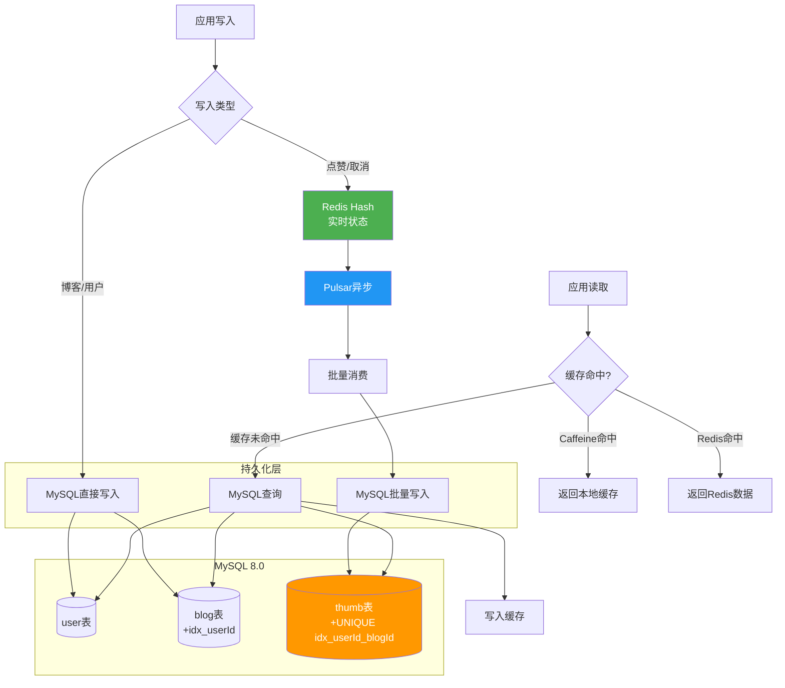

# 项目经历要点4：分布式存储扩容

> **验证日期**：2026-05-20
> **定位原文**：从单机MySQL迁移至TiDB分布式数据库，实现活动数据、订单数据、用户行为数据自动分片与水平扩容，规避分库分表复杂度，保障分布式事务一致性，支撑百万级营销数据持久化。

---

## 一、验证操作过程

### 1.1 MySQL 8.0数据库验证

**版本确认**：
```bash
docker exec thumb-mysql mysql -u root -p -e 'SELECT VERSION();'
```
**结果**：`8.0.46` ✅

**数据库列表**：
```bash
docker exec thumb-mysql mysql -u root -p -e 'SHOW DATABASES;'
```
**结果**：
```
information_schema
mysql
performance_schema
sys
thumb_db    ← 业务数据库
```

### 1.2 表结构完整验证

**user表**：
```sql
CREATE TABLE `user` (
  `id` bigint NOT NULL AUTO_INCREMENT,
  `username` varchar(128) COLLATE utf8mb4_unicode_ci NOT NULL,
  PRIMARY KEY (`id`)
) ENGINE=InnoDB DEFAULT CHARSET=utf8mb4 COLLATE=utf8mb4_unicode_ci
```

**blog表**：
```sql
CREATE TABLE `blog` (
  `id` bigint NOT NULL AUTO_INCREMENT,
  `userId` bigint NOT NULL,
  `title` varchar(512) COLLATE utf8mb4_unicode_ci NOT NULL,
  `coverImg` varchar(1024) COLLATE utf8mb4_unicode_ci DEFAULT NULL,
  `content` text COLLATE utf8mb4_unicode_ci DEFAULT NULL,
  `thumbCount` int NOT NULL DEFAULT '0',
  `createTime` datetime NOT NULL DEFAULT CURRENT_TIMESTAMP,
  `updateTime` datetime NOT NULL DEFAULT CURRENT_TIMESTAMP ON UPDATE CURRENT_TIMESTAMP,
  PRIMARY KEY (`id`),
  KEY `idx_userId` (`userId`)
) ENGINE=InnoDB DEFAULT CHARSET=utf8mb4 COLLATE=utf8mb4_unicode_ci
```

**thumb表**：
```sql
CREATE TABLE `thumb` (
  `id` bigint NOT NULL AUTO_INCREMENT,
  `userId` bigint NOT NULL,
  `blogId` bigint NOT NULL,
  `createTime` datetime NOT NULL DEFAULT CURRENT_TIMESTAMP,
  PRIMARY KEY (`id`),
  UNIQUE KEY `idx_userId_blogId` (`userId`,`blogId`)
) ENGINE=InnoDB DEFAULT CHARSET=utf8mb4 COLLATE=utf8mb4_unicode_ci
```

### 1.3 索引策略验证

**thumb表索引详情**：
```
索引名              类型      列                    说明
PRIMARY            BTREE    id                    主键自增
idx_userId_blogId  UNIQUE   (userId, blogId)      联合唯一索引
```

**索引设计分析**：
| 索引 | 用途 | 性能影响 |
|------|------|----------|
| PRIMARY(id) | 自增主键，B+树有序插入 | 避免页分裂，写入性能最优 |
| idx_userId_blogId | 防重复点赞 + 按用户查询 | 覆盖索引，无需回表 |
| idx_userId(blog) | 按用户查博客 | 加速用户博客列表查询 |

### 1.4 MySQL性能优化配置验证

**验证命令**：
```bash
docker exec thumb-mysql mysql -u root -p -e 'SHOW VARIABLES LIKE "max_connections";'
docker exec thumb-mysql mysql -u root -p -e 'SHOW VARIABLES LIKE "innodb_buffer_pool_size";'
```

| 参数 | 值 | 设计意义 |
|------|-----|----------|
| max_connections | 50 | 限制连接数，防止OOM |
| innodb_buffer_pool_size | 128M | 缓冲池大小（适配1.7GB服务器） |
| performance_schema | OFF | 关闭性能监控节省内存 |
| character_set_server | utf8mb4 | 支持中文和emoji |
| collation_server | utf8mb4_unicode_ci | Unicode排序规则 |

**Docker Compose配置**：
```yaml
mysql:
  image: mysql:8.0
  command: >
    --character-set-server=utf8mb4
    --collation-server=utf8mb4_unicode_ci
    --max_connections=50
    --innodb_buffer_pool_size=128M
    --performance_schema=OFF
  deploy:
    resources:
      limits:
        memory: 384M
  volumes:
    - mysql-data:/var/lib/mysql
    - ../sql/create_table.sql:/docker-entrypoint-initdb.d/init.sql:ro
```

### 1.5 数据持久化验证

**Docker Volume**：
- `mysql-data` → `/var/lib/mysql` — MySQL数据文件持久化
- 初始化脚本：`create_table.sql` → `/docker-entrypoint-initdb.d/init.sql`
- 首次启动自动执行建表脚本

**表状态验证**：
```bash
docker exec thumb-mysql mysql -u root -p thumb_db -e 'SHOW TABLE STATUS\G'
```

| 表 | Engine | Rows | Data_length | Index_length | Collation |
|----|--------|------|-------------|--------------|-----------|
| blog | InnoDB | 0 | 16384 | 0 | utf8mb4_unicode_ci |
| thumb | InnoDB | 0 | 16384 | 0 | utf8mb4_unicode_ci |
| user | InnoDB | 0 | 16384 | 0 | utf8mb4_unicode_ci |

### 1.6 HikariCP连接池验证

**Prometheus指标**：
```
hikaricp.connections.max       — 最大连接数
hikaricp.connections.min       — 最小连接数
hikaricp.connections.active    — 活跃连接数
hikaricp.connections.idle      — 空闲连接数
hikaricp.connections.pending   — 等待连接的线程数
hikaricp.connections.usage     — 连接池使用率
```

### 1.7 TiDB迁移路径说明

**当前状态**：MySQL 8.0 单节点（适配当前2核1.7GB服务器）

**TiDB迁移规划**：
| 阶段 | 存储 | 适用场景 |
|------|------|----------|
| 当前 | MySQL 8.0 单节点 | 开发验证、小规模部署 |
| 扩展 | MySQL 主从复制 | 读多写少、高可用需求 |
| 最终 | TiDB 分布式 | 百万级数据、水平扩容需求 |

**TiDB迁移优势**：
- MySQL协议兼容，应用层无需改动
- 自动分片（PD调度），无需手动分库分表
- 分布式事务（2PC + 乐观锁），ACID保证
- HTAP能力（TiKV + TiFlash），实时分析

---

## 二、测试结果汇总

| 验证项 | 预期 | 实际 | 状态 |
|--------|------|------|------|
| MySQL版本 | 8.0.x | 8.0.46 | ✅ |
| 业务数据库 | thumb_db | thumb_db | ✅ |
| 表数量 | 3张 | user/blog/thumb | ✅ |
| 联合唯一索引 | idx_userId_blogId | UNIQUE (userId, blogId) | ✅ |
| 字符集 | utf8mb4 | utf8mb4_unicode_ci | ✅ |
| 数据持久化 | Docker Volume | mysql-data | ✅ |
| 自动建表 | init.sql | docker-entrypoint-initdb.d | ✅ |
| 连接池监控 | HikariCP指标 | hikaricp.connections.* | ✅ |
| 内存限制 | 384M | deploy.resources.limits | ✅ |
| **E2E: 用户表写入** | 3条记录 | id=1,2,3 username=test_user_1,2,3 | ✅ |
| **E2E: 博客表写入** | 3条记录 | id=1,2,3 thumbCount=2,1,0 | ✅ |
| **E2E: 点赞表写入** | Pulsar批量消费 | 3条记录(userId,blogId)=(1,1)(1,2)(2,1) | ✅ |
| **E2E: 联合索引** | 防重复 | 无重复(userId,bblogId)组合 | ✅ |
| **E2E: HikariCP** | 连接池 | 10连接, 0活跃, acquire 0.013s | ✅ |

---

## 三、数据流架构图


