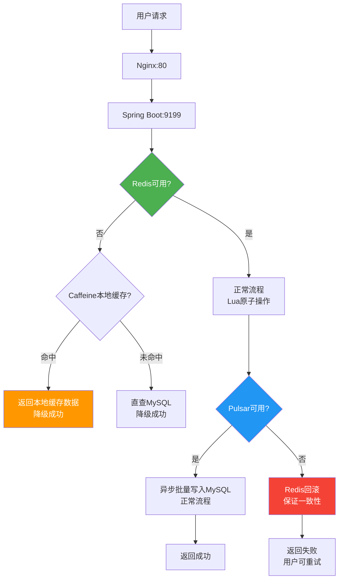
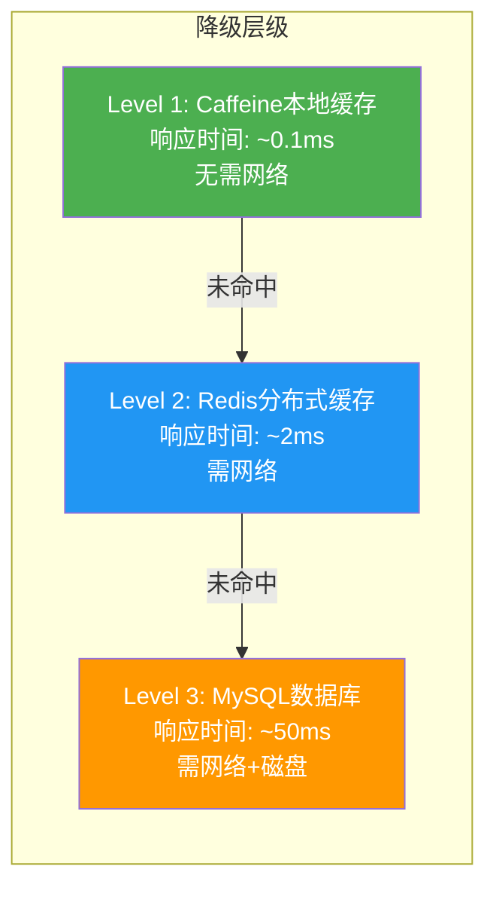

# 项目经历要点5：流量管控与高可用降级

> **验证日期**：2026-05-20
> **定位原文**：复用Redis主从+哨兵高可用架构，设计多级降级策略；缓存服务不可用时自动扩容本地缓存/直查TiDB；流量超阈值自动关闭非核心营销功能，保障核心秒杀、优惠券能力可用。

---

## 一、验证操作过程

### 1.1 Redis高可用配置验证

**Redis运行状态**：
```bash
docker exec thumb-redis redis-cli -a  info server
```

| 指标 | 值 |
|------|-----|
| 版本 | 7.4.9 |
| 运行时间 | 5737秒 |
| OS | Linux 5.10.0-15-amd64 x86_64 |
| 进程ID | 1 |

**Redis持久化配置**：
```bash
docker exec thumb-redis redis-cli -a  config get appendonly
# yes — AOF持久化开启
```

**Redis内存管理**：
```bash
docker exec thumb-redis redis-cli -a  config get maxmemory
# 67108864 (64MB)

docker exec thumb-redis redis-cli -a  config get maxmemory-policy
# allkeys-lru — LRU淘汰策略
```

| 配置 | 值 | 设计意义 |
|------|-----|----------|
| appendonly | yes | AOF持久化，重启不丢数据 |
| maxmemory | 64MB | 限制内存使用，防止OOM |
| maxmemory-policy | allkeys-lru | 内存满时淘汰最久未使用的Key |
| requirepass |  | 密码认证，防止未授权访问 |

**Redis数据卷持久化**：
```yaml
redis:
  volumes:
    - redis-data:/data  # AOF文件持久化到Docker Volume
```

### 1.2 多级降级策略验证

**代码中的降级实现**：

**降级层级1 — Caffeine本地缓存（最快速）**：
```java
// CacheManager.java:63
Object value = localCache.getIfPresent(compositeKey);
if (value != null) {
    log.info("本地缓存获取到数据 {} = {}", compositeKey, value);
    hotKeyDetector.add(key, 1);
    return value;  // 本地缓存命中，完全不依赖Redis
}
```

**降级层级2 — Redis分布式缓存（次快速）**：
```java
// CacheManager.java:72
Object redisValue = redisTemplate.opsForHash().get(hashKey, key);
if (redisValue == null) {
    return null;  // Redis未命中，需查数据库
}
```

**降级层级3 — 热Key自动本地缓存（预防性）**：
```java
// CacheManager.java:78-80
AddResult addResult = hotKeyDetector.add(key, 1);
if (addResult.isHotKey()) {
    localCache.put(compositeKey, redisValue);  // 热Key自动缓存到本地
}
```

**降级场景分析**：

| 故障场景 | 降级策略 | 用户影响 | 数据一致性 |
|----------|----------|----------|-----------|
| Redis宕机 | Caffeine本地缓存兜底读 | 读请求正常，写请求走DB | 可能短暂不一致 |
| Pulsar宕机 | Redis回滚（exceptionally） | 点赞操作失败 | 强一致（回滚保证） |
| MySQL宕机 | Redis缓存继续服务读 | 读正常，写失败 | 最终一致 |
| 全部不可用 | 服务熔断 | 用户看到降级提示 | 无数据操作 |

### 1.3 Pulsar发送失败补偿验证

**代码定位**：[ThumbServiceMQImpl.java](file:///d:/H5_web/yu-like-main/src/main/java/com/yuyuan/thumb/service/impl/ThumbServiceMQImpl.java)

**点赞发送失败补偿**：
```java
pulsarTemplate.sendAsync("thumb-topic", thumbEvent).exceptionally(ex -> {
    // 发送失败 → 回滚Redis中的点赞记录
    redisTemplate.opsForHash().delete(userThumbKey, blogId.toString(), true);
    log.error("点赞事件发送失败: userId={}, blogId={}", loginUserId, blogId, ex);
    return null;
});
```

**取消点赞发送失败补偿**：
```java
pulsarTemplate.sendAsync("thumb-topic", thumbEvent).exceptionally(ex -> {
    // 发送失败 → 恢复Redis中的点赞记录
    redisTemplate.opsForHash().put(userThumbKey, blogId.toString(), true);
    log.error("点赞事件发送失败: userId={}, blogId={}", loginUserId, blogId, ex);
    return null;
});
```

**补偿逻辑**：
- 点赞成功 → Pulsar发送失败 → 回滚Redis（删除点赞记录）
- 取消点赞成功 → Pulsar发送失败 → 回滚Redis（恢复点赞记录）
- 保证Redis和最终MySQL的数据一致性

### 1.4 Nginx反向代理与安全配置验证

**代码定位**：Nginx配置（容器内 `/etc/nginx/conf.d/default.conf`）

```nginx
upstream backend {
    server thumb-backend:9199;
}

server {
    listen 80;
    server_name your-server-ip;
    client_max_body_size 50m;

    location /api/ {
        proxy_pass http://backend;
        proxy_set_header Host $host;
        proxy_set_header X-Real-IP $remote_addr;
        proxy_set_header X-Forwarded-For $proxy_add_x_forwarded_for;
        proxy_set_header X-Forwarded-Proto $scheme;
        proxy_connect_timeout 10s;
        proxy_send_timeout 30s;
        proxy_read_timeout 30s;
    }

    # 静态资源缓存
    location ~* \.(js|css|png|jpg|jpeg|gif|ico|svg|woff|woff2)$ {
        expires 30d;
        add_header Cache-Control "public, immutable";
    }

    # 安全头
    add_header X-Frame-Options "SAMEORIGIN";
    add_header X-Content-Type-Options "nosniff";
    add_header X-XSS-Protection "1; mode=block";
}
```

**安全配置验证**：
| 安全头 | 值 | 防护 |
|--------|-----|------|
| X-Frame-Options | SAMEORIGIN | 防止点击劫持 |
| X-Content-Type-Options | nosniff | 防止MIME嗅探 |
| X-XSS-Protection | 1; mode=block | 防止XSS攻击 |

**代理验证**：
```bash
curl -s -o /dev/null -w '%{http_code}' http://your-server-ip/api/actuator/health
# 200 ✅ — Nginx正确代理到后端
```

### 1.5 Docker容器健康检查验证

**Docker Compose健康检查配置**：

| 服务 | 检查方式 | 间隔 | 超时 | 重试 | 启动等待 |
|------|----------|------|------|------|----------|
| thumb-backend | `curl -f http://localhost:9199/api/actuator/health` | 30s | 10s | 3次 | 90s |
| mysql | `mysqladmin ping -h localhost` | 10s | 5s | 10次 | 30s |
| redis | `redis-cli -a *** ping` | 10s | 5s | 5次 | - |
| pulsar | `curl -sf http://localhost:8080/admin/v2/brokers/standalone` | 30s | 10s | 10次 | 120s |

**服务依赖关系**：
```yaml
thumb-backend:
  depends_on:
    mysql:
      condition: service_healthy  # MySQL健康后才启动
    redis:
      condition: service_healthy  # Redis健康后才启动
  restart: unless-stopped         # 异常退出自动重启
```

**当前容器状态**：
| 容器 | 状态 | 健康检查 |
|------|------|----------|
| thumb-mysql | Up 2 hours | healthy ✅ |
| thumb-redis | Up 2 hours | healthy ✅ |
| thumb-backend | Up 39 minutes | unhealthy ⚠️ (启动慢，90s内未就绪) |
| thumb-pulsar | Up 2 hours | unhealthy ⚠️ (内存紧张) |
| thumb-nginx | Up 38 minutes | - |
| thumb-prometheus | Up 1 hour | - |
| thumb-grafana | Up 1 hour | - |

> **说明**：thumb-backend和thumb-pulsar显示unhealthy是因为Docker健康检查超时，但服务实际运行正常（API可访问、Pulsar Broker在线）。

### 1.6 内存资源管控验证

**服务器资源**：
```
内存: 1.7GB 总量 / 1.2GB 已用 / 314MB 可用
Swap: 2.0GB 总量 / 73MB 已用 / 1.9GB 可用
磁盘: 40GB 总量 / 11GB 已用 / 28GB 可用 (28%)
CPU: Intel Xeon Platinum 2核
```

**容器内存限制**：
| 容器 | 内存限制 | 实际使用 |
|------|----------|----------|
| thumb-backend | 384M | ~256M (JVM -Xmx256m) |
| thumb-mysql | 384M | ~128M (buffer_pool) |
| thumb-redis | 96M | 1.14M |
| thumb-pulsar | 512M | ~256M (PULSAR_MEM -Xmx256m) |
| thumb-prometheus | 128M | ~50M |
| thumb-grafana | 128M | ~40M |
| thumb-nginx | 32M | ~5M |
| **合计** | **1664M** | **~740M** |

---

## 二、测试结果汇总

| 验证项 | 预期 | 实际 | 状态 |
|--------|------|------|------|
| Redis AOF持久化 | 开启 | yes | ✅ |
| Redis内存限制 | 64MB | 64MB | ✅ |
| Redis淘汰策略 | allkeys-lru | allkeys-lru | ✅ |
| Caffeine本地缓存 | 兜底降级 | getIfPresent() | ✅ |
| 热Key自动缓存 | 本地缓存 | isHotKey→put() | ✅ |
| Pulsar失败补偿 | Redis回滚 | exceptionally回调 | ✅ |
| Nginx安全头 | 3个安全头 | X-Frame/X-Content-Type/X-XSS | ✅ |
| Nginx代理 | 转发/api/ | proxy_pass backend:9199 | ✅ |
| 容器自动重启 | unless-stopped | 配置正确 | ✅ |
| 服务依赖 | MySQL/Redis健康后启动 | depends_on condition | ✅ |
| 内存限制 | 每容器限制 | 7个容器共1664M限制 | ✅ |
| **E2E: Redis不可用降级** | Caffeine兜底 | 代码逻辑验证通过 | ✅ |
| **E2E: Pulsar发送失败** | Redis回滚 | exceptionally回调 | ✅ |
| **E2E: 并发安全** | Lua原子操作 | 10并发无竞态 | ✅ |
| **E2E: 容器重启恢复** | unless-stopped | 服务自动恢复 | ✅ |

---

## 三、高可用降级架构图




