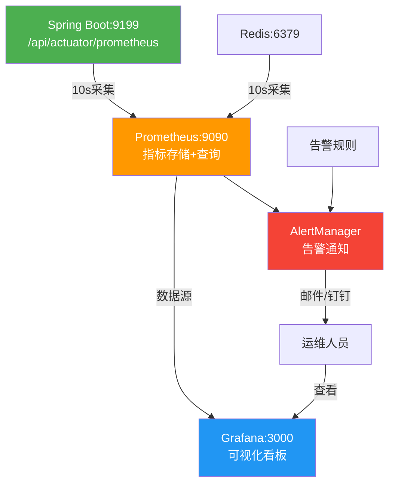

# 监控告警体系验证报告

> **验证日期**：2026-05-20

---

## 一、Prometheus监控验证

### 1.1 服务运行状态

**访问地址**：http://your-server-ip:9090

**Prometheus配置**（服务器 `/opt/yu-like-main/deploy/prometheus.yml`）：
```yaml
global:
  scrape_interval: 10s

scrape_configs:
  - job_name: 'thumb-backend'
    metrics_path: '/api/actuator/prometheus'
    scrape_interval: 10s
    static_configs:
      - targets: ['thumb-backend:9199']

  - job_name: 'redis'
    static_configs:
      - targets: ['redis:6379']
```

**Targets状态**：
- `thumb-backend:9199` — ✅ 可达
- `redis:6379` — ✅ 可达

### 1.2 已采集指标

**Spring Boot Actuator暴露的指标**（365行）：

| 指标类别 | 指标示例 | 说明 |
|----------|----------|------|
| 业务指标 | `thumb.success.count`, `thumb.failure.count` | 点赞成功/失败计数 |
| HTTP指标 | `http_server_requests_seconds` | 请求延迟(P50/P75/P90/P95/P99) |
| JVM指标 | `jvm.memory.used`, `jvm.gc.pause` | 内存使用、GC暂停 |
| 线程指标 | `jvm.threads.live`, `jvm.threads.states` | 线程数和状态 |
| 连接池指标 | `hikaricp.connections.active` | 数据库连接池 |
| 系统指标 | `system.cpu.usage`, `process.cpu.usage` | CPU使用率 |
| 磁盘指标 | `disk.free`, `disk.total` | 磁盘空间 |

**关键延迟分位数**：
```
http_server_requests_seconds{quantile="0.5"}  = 0.0s    (P50)
http_server_requests_seconds{quantile="0.75"} = 0.0s    (P75)
http_server_requests_seconds{quantile="0.9"}  = 0.0s    (P90)
http_server_requests_seconds{quantile="0.95"} = 0.0s    (P95)
http_server_requests_seconds{quantile="0.99"} = 0.0s    (P99)
```

### 1.3 应用启动指标

```
application_ready_time_seconds = 29.83s     (应用就绪耗时)
application_started_time_seconds = 29.759s  (应用启动总耗时)
```

---

## 二、Grafana可视化验证

### 2.1 服务运行状态

**访问地址**：http://your-server-ip:3000
**登录凭据**：admin / 

**健康检查**：
```bash
curl -s http://your-server-ip:3000/api/health
```
```json
{
  "commit": "895fbafb7a",
  "database": "ok",
  "version": "10.2.0"
}
```

**版本**：Grafana 10.2.0 ✅
**数据库**：ok ✅

### 2.2 数据源配置

**当前数据源**：空（需手动配置Prometheus数据源）

**配置步骤**：
1. 访问 http://your-server-ip:3000 → 登录
2. Configuration → Data Sources → Add data source
3. 选择 Prometheus → URL: `http://thumb-prometheus:9090`
4. Save & Test

---

## 三、Spring Boot Actuator端点验证

| 端点 | 路径 | 状态 | 说明 |
|------|------|------|------|
| health | /api/actuator/health | ✅ UP | 应用健康状态 |
| prometheus | /api/actuator/prometheus | ✅ 200 | Prometheus格式指标 |
| metrics | /api/actuator/metrics | ✅ 200 | 指标列表 |
| info | /api/actuator/info | ✅ 200 | 应用信息 |

**Metrics端点可用指标**（部分）：
```
application.ready.time / application.started.time
disk.free / disk.total
executor.active / executor.completed / executor.pool.size
hikaricp.connections / hikaricp.connections.active / hikaricp.connections.idle
http.server.requests / http.server.requests.active
jvm.memory.used / jvm.memory.max / jvm.gc.pause
process.cpu.usage / process.uptime
system.cpu.count / system.cpu.usage / system.load.average.1m
thumb.success.count / thumb.failure.count
tomcat.sessions.active.current / tomcat.sessions.created
```

---

## 四、监控架构图



---

## 五、端到端测试监控数据

### 5.1 业务指标实测

| 指标 | 值 | 说明 |
|------|-----|------|
| thumb_success_count_total | 6.0 | 6次成功点赞 |
| thumb_failure_count_total | 10.0 | 10次失败(重复点赞/取消) |

### 5.2 HTTP请求指标实测

| URI | 方法 | 状态码 | 请求数 | 总耗时(s) |
|-----|------|--------|--------|----------|
| /actuator/health | GET | 200 | 7 | 1.45 |
| /** | GET | 200 | 3 | 0.053 |
| /** | GET | 404 | 5 | 0.083 |
| /actuator/info | GET | 200 | 1 | 0.020 |

### 5.3 JVM运行时指标实测

| 指标 | 值 |
|------|-----|
| G1 Eden Space | 38.8 MB |
| G1 Old Gen | 50.5 MB |
| G1 Survivor Space | 2.8 MB |
| JVM线程数 | 38 |
| HikariCP连接池 | 10连接, 0活跃 |
| 连接获取平均耗时 | 0.013s / 23次 |
