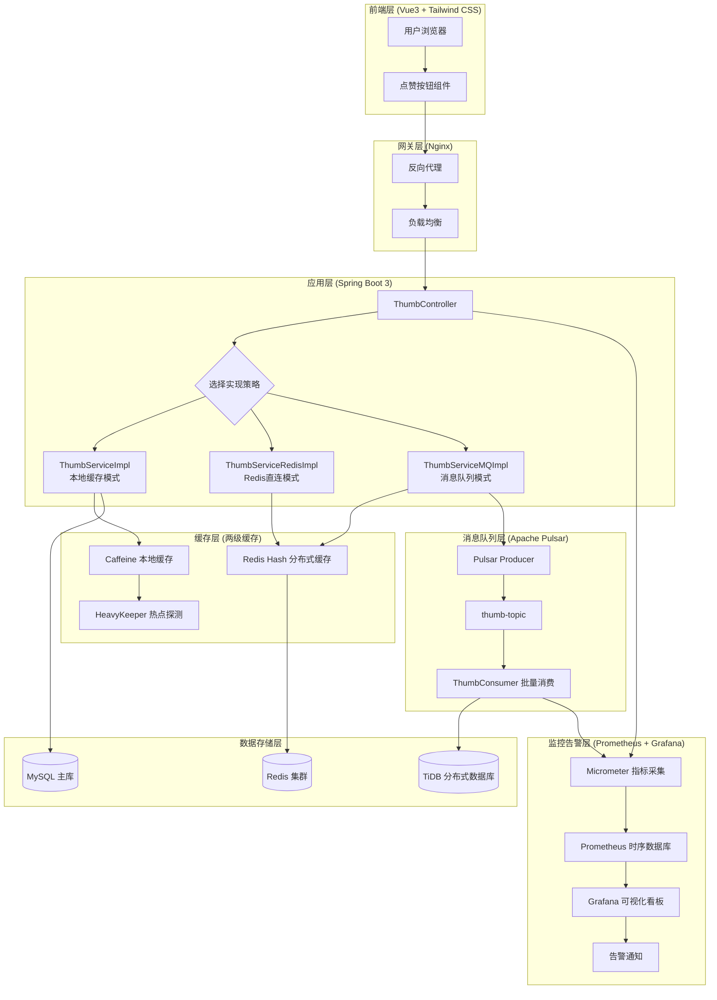

# 点赞系统整体架构流程图

```mermaid
graph TB
    subgraph 前端层["前端层 (Vue3 + Tailwind CSS)"]
        A[用户浏览器] --> B[点赞按钮组件]
    end
    
    subgraph 网关层["网关层 (Nginx)"]
        B --> C[反向代理]
        C --> D[负载均衡]
    end
    
    subgraph 应用层["应用层 (Spring Boot 3)"]
        D --> E[ThumbController]
        E --> F{选择实现策略}
        
        F --> G[ThumbServiceImpl<br/>本地缓存模式]
        F --> H[ThumbServiceRedisImpl<br/>Redis直连模式]
        F --> I[ThumbServiceMQImpl<br/>消息队列模式]
    end
    
    subgraph 缓存层["缓存层 (两级缓存)"]
        G --> J[Caffeine 本地缓存]
        H --> K[Redis Hash 分布式缓存]
        I --> K
        J --> L[HeavyKeeper 热点探测]
    end
    
    subgraph 消息队列层["消息队列层 (Apache Pulsar)"]
        I --> M[Pulsar Producer]
        M --> N[thumb-topic]
        N --> O[ThumbConsumer 批量消费]
    end
    
    subgraph 数据层["数据存储层"]
        O --> P[(TiDB 分布式数据库)]
        G --> Q[(MySQL 主库)]
        K --> R[(Redis 集群)]
    end
    
    subgraph 监控层["监控告警层 (Prometheus + Grafana)"]
        E --> S[Micrometer 指标采集]
        O --> S
        S --> T[Prometheus 时序数据库]
        T --> U[Grafana 可视化看板]
        U --> V[告警通知]
    end
```
