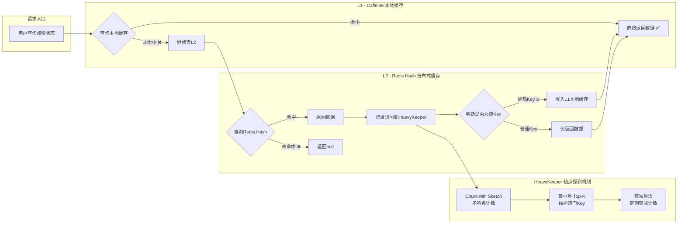

# 两级缓存架构流程图

## 缓存读取优先级

1. **第一级：Caffeine 本地缓存**
   - 容量：1000条记录
   - 过期时间：5分钟（write-after-expire）
   - 优势：零网络开销，纳秒级响应

2. **第二级：Redis Hash 分布式缓存**
   - 数据结构：Hash（user_id -> blog_id -> thumb_id）
   - 优势：支持跨实例共享，数据一致性高

3. **热点识别与自动提升**
   - HeavyKeeper算法实时统计访问频率
   - 自动将热Key提升至L1本地缓存
   - 定时衰减避免冷数据占用资源
