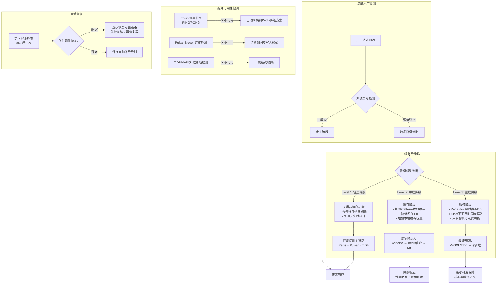

# 高可用降级策略流程图

## 降级触发条件

### Level 1 - 轻度降级（流量 > 阈值70%）
- 触发条件：QPS超过系统容量70%
- 影响：关闭非核心营销功能
- 用户体验：基本无感知

### Level 2 - 中度降级（流量 > 阈值85% 或 Redis延迟升高）
- 触发条件：
  - QPS超过85%
  - Redis响应时间 > 50ms
  - 错误率 > 1%
- 影响：增强本地缓存，减少Redis依赖
- 用户体验：查询可能稍慢

### Level 3 - 重度降级（组件故障）
- 触发条件：
  - Redis完全不可用
  - PulsarBroker连接失败
  - 数据库连接池耗尽
- 影响：降级为最简架构
- 用户体验：功能可用但性能下降
